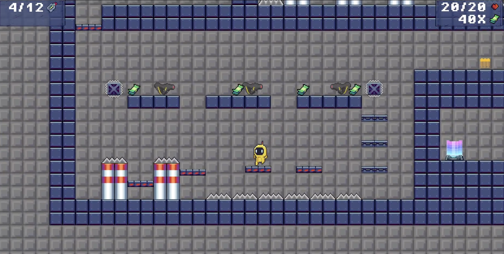

# Artifact Odyssey

## Description
Artifact Odyssey is an exciting and engaging game where players navigate through various challenges and obstacles to gather all artifacts. The game is designed to test your strategic thinking and problem-solving skills. There are also some hidden easter eggs referencing FEUP and their teachers!

## Instructions to Play
1. **Start the Game**: Launch the game by running the executable file or opening the game application.
2. **Controls**:
   - **Movement**: Use the arrow keys or WASD keys to move your character.
   - **Jump**: Use the UP/W/spacebar to jump.
   - **Action**: Press the E key to interact with objects or perform actions.
   - **Pause**: Press the escape/P key to pause the game and access the pause menu.
3. **Objective**: Collect money, unlock chests, and gather all artifacts to win the game!
4. **Saving and Loading**: The game **does not save** progress, so be cautious. If you die, you will restart from the beginning and lose all your progress.
5. **Tips**:
   - Pay attention to the hints and tips provided during the game.
   - Explore the environment thoroughly to find hidden items and secrets.
   - Practice makes perfect – don't be afraid to retry in order to improve your performance.

Enjoy playing Artifact Odyssey and have fun!

